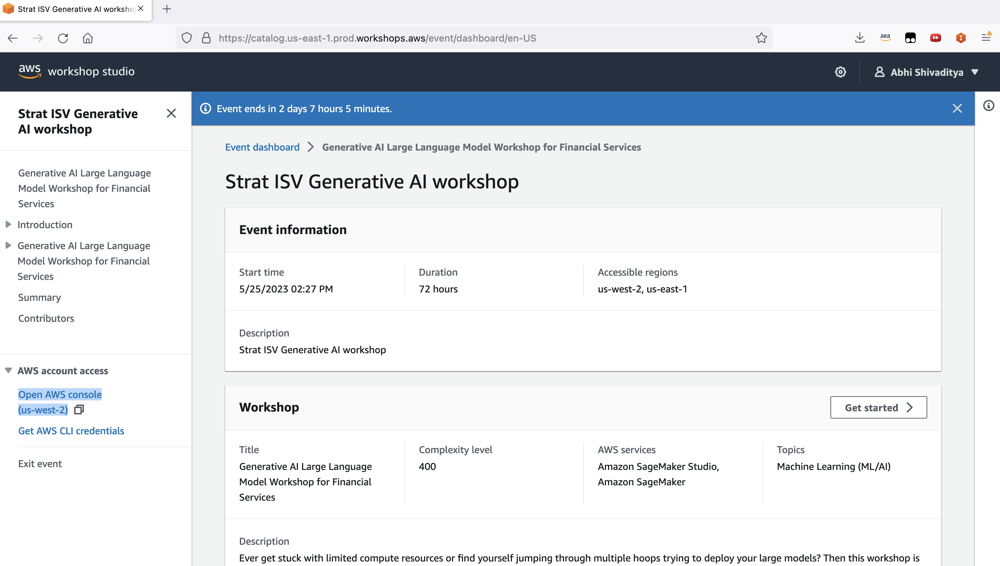

# LLM Builder Workshop Hands on Helper Guide

## Agenda


## Setup

1. Click on Workshop link and sign in using your email address:
    1. TBA

2. Once logged in, click on Console access on bottom left, make sure us-east-2 is selected



3. Go to Sagemaker and open Notebook Instance that is provisioned. Deep Link: https://us-east-2.console.aws.amazon.com/sagemaker/home?region=us-west-2#/notebook-instances

4. Spin up a new notebook instance by clicking `Create notebook instance`. Choose a name like g5-12xl and select instance type `ml.g5.12xlarge` from the dropdown. 

5. Expand `Addtional Configuration`, and change `Volume size in GB` to `250`

6. Click create Notebook and allow it some time to spin up. Next open the notebook instance by clicking `Open Jupyter`.

7. Spin up a terminal and git clone this repo


```
cd SageMaker/
git clone https://github.com/ashivadi/workshop9-12.git
```

Tip: Choose `conda_python3` kernel if asked for the following labs.


## Lab 1 Instructions: Fine tune with LORA

Open and run the notebook `1. Fine tune with LORA.ipynb` 

## Lab 2 Instructions: Fine tune with FSDP.ipynb 

Open and run the notebook `2. Fine tune with FSDP.ipynb`